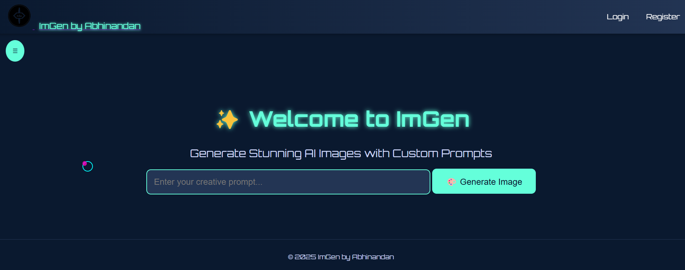

# **ImGen - AI-Powered Image Generation**  
**An advanced AI-driven image generation platform with a futuristic UI.**  

  

---

## 📌 **Overview**  
**ImGen** is a **Flask-based** AI image generation web application that enables users to generate high-quality AI images from text prompts. It features **user authentication**, **image watermarking**, **image history tracking**, and a **sci-fi neon-inspired UI**.  

---

## 🚀 **Features**  
✔️ **AI-Powered Image Generation** – Generate unique images from text prompts.  
✔️ **User Authentication** – Secure login & registration with password protection.  
✔️ **Image History & Gallery** – Save, manage, and delete generated images.  
✔️ **Watermarking** – Protected images with custom watermarks.  
✔️ **Sci-Fi Themed UI** – A sleek, futuristic neon design.  

---

## ⚡ **Installation & Setup**  

### **1️⃣ Prerequisites**  
Ensure you have the following installed:  
- **Python (>=3.8)**  
- **Flask**  
- **Pipenv or Virtualenv** (Recommended for dependency management)  

### **2️⃣ Clone the Repository**  
```bash
git clone https://github.com/abhinandansgit/imgen.git
cd imgen
```

### **3️⃣ Install Dependencies**  
```bash
pip install -r requirements.txt
```

### **4️⃣ Run the Application**  
```bash
python app.py
```
The application will be available at **http://127.0.0.1:5000/**.

---

## 🎨 **Usage Guide**  

### **🔹 User Authentication & Login**  
1. **Register** a new account or **log in** using existing credentials.  
2. The **password toggle button** allows users to view or hide their password.  
3. **Toast notifications** provide feedback on login status:  
   - ✅ **Login successful**  
   - ⚠️ **Incorrect password**  
   - ❌ **Login failed**  

### **🔹 Generating Images**  
1. Enter a **detailed text prompt** in the input box.  
2. Click **"Generate Image"**.  
3. The AI processes the prompt and generates an image.  
4. The image appears in the **gallery section** with options to **download** or **delete**.  

### **🔹 Managing Images**  
- Click **Download ⬇️** to save the image.  
- Click **Delete ❌** to remove an image from history.  
- A option to **view** by clicking on generated image.  

---

## 🛠 **Tech Stack**  
🔹 **Backend:** Flask, Python  
🔹 **Frontend:** HTML, CSS (Neon Sci-Fi UI), JavaScript  
🔹 **Database:** SQLite (for user authentication and image history)  
🔹 **AI Model:**  Custom ML model / Image generation API  

---

## 📜 **License**  
**Copyright (c) 2025 Abhinandan Parhi**  
Licensed under the **ImGen License** *(strict usage terms apply, see LICENSE file)*.  

---

## 🤝 **Contributing**  
Pull requests are welcome! For major changes, please open an issue first to discuss what you’d like to modify.  

---

## 📩 **Contact & Support**  
For issues, suggestions, or collaboration, reach out via:  
📧 **Email:** abhinandanparhi48@gmail.com  
🔗 **LinkedIn:** [LinkedIn](https://linkedin.com/in/abhinandan-parhi-ap)  
🚀 **Project Updates:** [GitHub Repo](https://github.com/abhinandansgit/imgen)

---
